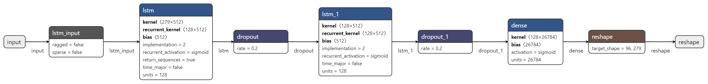

# Forecasting Parking Availability Using LSTM Neural Network
#### Authors
- [Wei Jun Poh](https://github.com/krypt-14)

This project is based on my final year group thesis from University of Sydney, where my group have presented on the theme of Smart City and how different sustainable method such as parking are an efficient way to manage and control traffic as well as control the number of vehicle can take in certain areas. 

For the purposes of the topic, I am only demonstrating on how the model is preprocess and develop to provide future forecasting for parking availability. 

## Overview
The project revolves around smart parking availability system based on the data collected from sensors placed in the parking bays around Melbourne, Australia. It delves into building an end to end model that predicts parking availability with a high confidence. This is for 15 minutes interval timesteps based on the location of road segment, user destination, date and time. The project aims to ameliorate traffic congestion issues and provide efficiency, by giving users prefictable insights into future parking conditions through seasonality. 

The prediction model is based on the long short-term memory (LSTM) neural networks and has been implemented on Melbourne CBD on-street parking dataset that has been preprocessed and aggregated on Google's Big Query. We achieved a test Mean Absolute Error (MAE) of 0.1634 for the year of 2019, with a two-layer stacked LSTM on a 24 hour multi step output. The prediction results are filtered to display the user preferences captured via a user interface (UI) that was built on Flask and Mapbox. We present an end to end model built on cloud tools as the building blocks for future work in a wide array of applications. This includes creating insights and patterns based on the occupancy and restriction violation data of the parking lots, helping the city council in making data driven decisions and better planning for the future.

## Model Architecture
The prediction model is based off a 2 layer stacked LSTM as shown below. It takes the aggregated [road segment data](https://github.com/krypt-14/Forecasting-Parking-Availability/blob/2966031d9927cf7bb0f76efe4bd9106e711900b4/parking_agg_pivot.zip) as input and produces a `my_model.h5` file and `scaler.pkl` which are fed into the UI for prediction.

The `model.ipynb` file is best run on a Google Colab instance with a GPU runtime (see notebook instructions for more details).

To begin training, run the `model.ipynb` file and follow the documentation as a guide.



## Tensorboard Hyperparameter Results

To view the hyperparemeter results, start by initializing the tensorboard in Google Colab.

```python
# Load the TensorBoard notebook extension
%load_ext tensorboard
```

Then load the appropriate log files using the path.


E.g.
```python
%tensorboard --logdir /tensorboard/logs/folder_name
```

For more on Hyperparameter tuning on Tensorboard, see here https://www.tensorflow.org/tensorboard/hyperparameter_tuning_with_hparams.

## Experiments
The Model iteration experiments as explained in the 4 - Documentation Report are added in the `experiments/` folder for completeness.


## Retraining the model
To retrain the model with a more up to date dataset, either load the latest data file csv/zip into the notebook and map it to `DATA_PATH` should get the latest clean data from the instance.

When using a new dataset, it is important to keep in mind the dimensionality of the trained model. The model has been trained on a set number of roadsegments as features (279 for 2017-2019 data), and running a new dataset will likely have a different number of columns. Therefore the model must be retrained in its entirety to account for this dimension change. Similar goes for adding external data as columns (follow the instructions in the notebook **Parameters** section on how to implement this).
